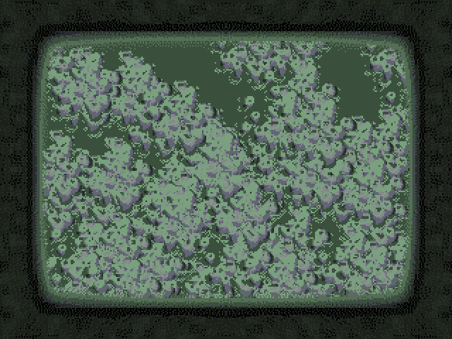

## SKOOLINA - A screen cleaner



### How to run

 * Install [Pyxel](https://github.com/kitao/pyxel "Pyxel - A retro game engine in Rust, scripted in Python") (v.1.6.9)
 * Run `python skoolina.py`
 
### Aim of this game

Well, as a game, you could decide that the goal is to uncover the title by cleaning off the grime as quick as possible.

However the reason for coding this game for me this morning was to explore the use of palettes and off-screen rendering in Pyxel.

I hope it will help someone.

### Generating and using the custom palette in your code

  * Use GIMP to create the image in the usual RGB Image Mode.
  * Switch to Indexed color mode (under Image->Mode->Indexed...)
  * In the Colormap section, select Generate optimum palette and set 16 colors
  * Export to a [PNG](http://www.libpng.org/pub/png/#history "It's pronounced PING !") image
  * Use [ImageMagick](https://imagemagick.org) to count the most used colors:
  
  ```
  magick -colorspace sRGB 3310-256.png -define histogram:unique-colors=true \
                 -format %c histogram:info:-
  ```
  
  It should output something like this:
  
  ```
    3478: (0,0,0,255) #000000FF black
    3794: (27,33,25,255) #1B2119FF srgba(27,33,25,1)
    531: (35,44,33,255) #232C21FF srgba(35,44,33,1)
    1126: (41,44,45,255) #292C2DFF srgba(41,44,45,1)
    38144: (45,50,53,0) #2D323500 srgba(45,50,53,0)
    35: (46,48,68,255) #2E3044FF srgba(46,48,68,1)
    774: (58,80,60,255) #3A503CFF srgba(58,80,60,1)
    136: (69,71,88,255) #454758FF srgba(69,71,88,1)
    903: (85,111,87,255) #556F57FF srgba(85,111,87,1)
    280: (98,101,115,255) #626573FF srgba(98,101,115,1)
    4294: (103,169,194,255) #67A9C2FF srgba(103,169,194,1)
    11872: (122,160,127,255) #7AA07FFF srgba(122,160,127,1)
    169: (133,135,139,255) #85878BFF srgba(133,135,139,1)

  ```
  
  It's possible that you get less than 16 colors, depending on your image.
  
  
  * Then simply copy the hex color codes to your source:

``` python
          self.palette = [0x000000, 0x1B2119, 0x232C21, 0x292C2D,
                        0x2E3044, 0x3A503C, 0x454758, 0x556F57,
                        0x626573, 0x67A9C2, 0x7AA07F, 0x85878B,
                        0xACAFAF, 0xCACDCD, 0xE6E8E7, 0xFFFFFF]
```

  * And load the coustom palette using:
  
```python
    pyxel.colors.from_list(self.palette)
```

  * Finally, load your image as usual:
  
``` python
    pyxel.image(1).load(0, 0, "3310-256.png")
```
   
Here's a handy palette display function I use when debugging my palettes:

``` python
    def drawPalette(self):
        for x in range(16):
            pyxel.rect(x * 4, 0, 4, 4, x)
            pyxel.text(x * 4, 4, str(x%10), 8)
```

